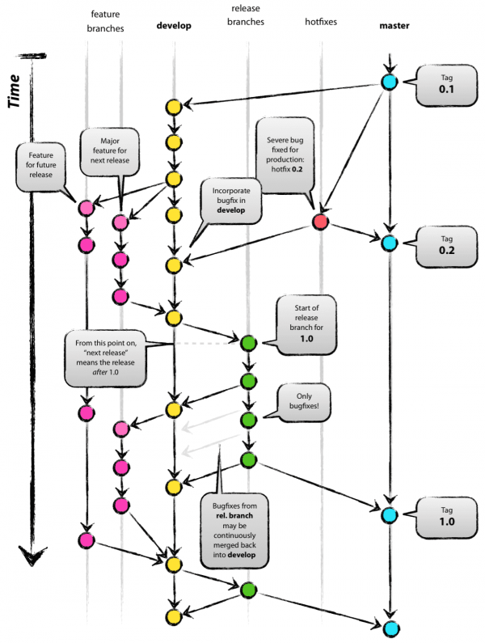

# Git e Gitflow

Esse é o manual de procedimentos que envolvem git e gitflow aqui na Wooza. Vamos detalhar todo o nosso fluxo, fiquem à vontade em sugerir melhorias em nosso fluxo. Em breve colocaremos mais detalhes que vão envolver micro-services, etc.

Aqui usamos o Azure DevOps como ferramente de Git e CI/CD.

## Pequena Introdução

Não sei o quanto vocês manjam de terminal, ssh e afins, mas fica a dica: tentem usar o máximo possível disso. É chato, digita mais, o visual é mais fácil? Sim, porém, o mercado pede muito disso em algumas empresas fodásticas. Teve uma entrevista que participei que o cara me perguntou se eu usava Mac e mexia com Terminal, falei que sim e odiava ferramentas visuais do Git, IDEs, etc. Recebi um puta elogio por isso e eles levam muito em consideração.

## Vamos falar de Gitflow

Segue uma imagem abaixo pra exemplificar:

Temos a branch master, que terá um espelho, que será uma tag. Pra quem não entende sobre tags no Git eu recomendo ver o link: [[https://git-scm.com/book/pt-br/v1/Git-Essencial-Tagging]].

Ela nada mais é que uma versão fechada e que não pode ser alterada, portanto, produção é o espelho da última tag.
