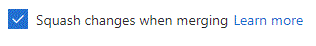
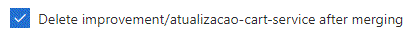

# Git e Gitflow

Esse é o manual de procedimentos que envolvem git e gitflow aqui na Wooza. Vamos detalhar todo o nosso fluxo, fiquem à vontade em sugerir melhorias em nosso fluxo. Em breve colocaremos mais detalhes que vão envolver micro-services, etc.

Aqui usamos o Azure DevOps como ferramente de Git e CI/CD.

## Pequena Introdução

Não sei o quanto vocês manjam de terminal, ssh e afins, mas fica a dica: tentem usar o máximo possível disso. É chato, digita mais, o visual é mais fácil? Sim, porém, o mercado pede muito disso em algumas empresas fodásticas.

Teve uma entrevista que participei que o cara me perguntou se eu usava Mac e mexia com Terminal, falei que sim e odiava ferramentas visuais do Git, IDEs, etc. Recebi um puta elogio por isso e eles levam muito em consideração.

## Vamos falar de Gitflow

Segue uma imagem abaixo pra exemplificar:


Temos a branch master, que terá um espelho, que será uma tag. Pra quem não entende sobre tags no Git eu recomendo ver o link: [[https://git-scm.com/book/pt-br/v1/Git-Essencial-Tagging]].

Ela nada mais é que uma versão fechada e que não pode ser alterada, portanto, produção é o espelho da última tag.

### Branches principais

Temos três branches principais:

* develop
* homolog
* master

**NUNCA** commite algo diretamente nessas branches, crie sempre uma branch a partir delas para fazer alguma modificação. Por menor que seja, **SEMPRE** crie uma branch.

Nosso fluxo perfeito de trabalho é criando branches a partir da **develop**. Essa branch é a que terá no ambiente de desenvolvimento, assim como a **homolog** é o espelho do que está no ambiente de homologação.

### Branches filhas

Temos o seguinte padrão para as branches filhas:

* bugfix/
* hotfix/
* feature/
* improvement/

Uma _feature/_ é sempre criada a partir da **develop**, a não ser que seja um componente que publicaremos no NPM, que no caso criamos as features a partir da **master**, não possuímos nem **develop** e nem **homolog** em componentes gerais para a empresa.

Uma branch _bugfix/_ pode ser criada a partir da **master** ou **homolog**, pois é uma branch emergencial. Caso isso seja feito em uma dessas branches, NÃO PODE ESQUECER de descer as modificações para as branches inferiores, por exemplo, se um _bugfix_ foi feito na **master**, você precisa descer a atualização para a **homolog** e **develop** **COM REBASE**, caso seja na **homolog**, depois precisa descer para a **develop** **COM REBASE**.

Uma branch _hotfix/_ chega a ser similar a **bugfix**, porém, ela é para correções rápidas que não são bugs, por exemplo, um acerto de texto, pontuação, cores, espaçamentos, coisas que são urgentes, mas não causam bugs.

Geralmente usamos a feature, que pelo nome já deu pra ver o que é. A bugfix, hotfix e improvement é para melhorar ou corrigir alguma feature que criamos. Depois que finalizarmos a feature, vamos criar o Pull Request.

### Nomes de branches

Já vimos nossos prefixos acima, porém, eles sozinhos não resolvem nada, três branches precisam de um sufixo, que será o seu nome _identificável_.

Pode ser qualquer nome, mas eles sempre devem ser com letras minúsculas. Caso seja um nome composto, será separado por traços _-_.

Vamos supor que seja uma solução para um problema no cartão de crédito:

* **bugfix/retorno-api-cartao**

Lembrando sempre de dar nomes que você tenha uma ideia do que será feito. **NUNCA** vamos usar o ID da Issue do Azure DevOps para nomear as branches. Assim como usar um **bugfix/resolvendo-bugs**, que não mostra o que está sendo realmente feito.

## Mensagens de commit

**NUNCA** faça commits com a mesma mensagem. Seja o mais específico possível com suas mensagens de commit. Se o desenvolvedor souber o que foi feito no PR somente com as mensagens de commit, ela foi feita de forma correta.

Seguimos o padrão do Commitizen, que tem abaixo a seguinte lista de prefixos de commit:


[Veja mais detalhes sobre como usar o commitizen](https://github.com/commitizen/cz-cli).

Siga o seguinte padrão de mensagem pra commit que você pode fazer no Gitbash, Cmder ou ConEmu:

```
git commit -m "feat: Head de tudo que foi feito

#ID_DA_TAREFA_QUE_VEM_NO_AZURE_DEVOPS
* descricao de algo que foi feito
* mas outra coisa que foi feita
* mais outra coisa feita"
```

Esse **ID_DA_TAREFA_QUE_VEM_NO_AZURE_DEVOPS** é aquele ID da tarefa que vocês pegam no Azure DevOps e geralmente tem 5 números. Fazendo isso você vincula aquela tarefa ao commit e ao PR, com isso, ao mergear o PR, sua tarefa será movida para _Resolved_ automaticamente. Essa opção é opcional, mas caso queira colocar, faça isso **SOMENTE EM UM COMMIT**.

Claro, não são todos os commits que precisam de uma mensagem grande dessa forma, nesses casos eu uso da seguinte forma:

`git commit -m "refactor: Tarefa realizada com uma descricao completa"`

Depois eu pego essa mensagem e colo numa seção chamada **## Outros** dentro da descrição do PR.

Não coloque acentuação e caracteres especiais nas mensagens de commit para evitar bugs malucos nos terminais.

### Commitlint

Um cara que usamos também é o [commitlint](https://github.com/conventional-changelog/commitlint). Com ele nós verificamos se sua mensagem de commit está dentro dos nossos padrões. Caso não seja, seu commit não será realizado.

## Rebase pré push e PR

Antes de vocês criarem o Pull Request no Azure DevOps, precisam seguir uns passos para não ter conflito no PR e ter que fazer o _merge_ manualmente.

### Feature finalizada localmente

Vamos supor que o nome da sua branch é _feature/testes-service-endereco_. Você já fez vários commits nela e agora precisa dar um push nela.

Quando você finalizar tudo nela, você, **ANTES DE DAR PUSH**, rodará os comandos:

```
git checkout develop
git pull origin develop
```

Isso deixará sua branch **develop** atualizada. Após isso rode os seguintes comandos:

```
git checkout feature/testes-service-endereco
git rebase --autosquash develop
```

Isso fará um rebase com o squash do que tem na **develop** na sua _feature_. Caso você queira alterar a mensagem de commit, coloque o _-i_: `git rebase -i --autosquash develop`.

Ele deixará sua branch zerada, sem commits nenhum. Depois ele aplicará todos os commits da **develop** na sua branch, para depois ele aplicar todos os seus commits.

Isso faz com que o histórico fique correto.

#### Outra forma

Ao invés dessa quantidade de comandos você pode lançar um único comando a seguir:

```
git pull origin develop --rebase
```

#### Resumindo...

Lembrando que em caso de uma _bugfix/_ na **homolog** ou **master**, o rebase também terá que ser feito de cima para baixo. Por exemplo, se a _bugfix/_ foi feita na **master**, você, após o PR, precisa atualizar sua branch **master** local e descer para a homolog com rebase:

```
git checkout homolog
git pull origin homolog
git pull origin master --rebase
```

Depois fazer o mesmo com a develop:

```
git checkout develop
git pull origin develop
git pull origin master --rebase
```

Caso não tenha tido conflitos, comemore e beba uma cerveja. Caso contrário...

#### Ferrou, deu conflito

Sem problemas, resolva seus conflitos localmente na sua IDE de preferência e depois adicione os arquivos no staging do git:

```
git add <arquivo1> <arquivo2> ...
git rebase --continue
```

Feito isso você pode dar _push_ na sua branch:

```
git push origin feature/testes-service-endereco
```

Caso tenha dado algum problema, troca de muita coisa, pode ser necessário usar o _force_, mas no caso use com o sufixo _--force-with-lease_, que é um _force_ menos agressivo.

```
git push origin feature/testes-service-endereco --force-with-lease
```

#### Pronto para o PR

Feito isso, você está pronto para o próximo passo...

## Pull Request

Pra quem não conhece, PR é o cara que faz o merge para uma de nossas branches principais: **develop**, **homolog** e **master**. Pull Requests são code reviews que o time terá. Nós fazemos isso no Azure DevOps, vocês verão um link Create Pull Request. Cliquem lá e depois deixem do lado esquerdo a branch que vocês acabaram de criar e do lado direito a branch principal que vocês precisaram alterar. Na grande maioria a branch principal apontada será a **develop**.

### Integrações

Peça para o PO do seu time ou algum dos Scrum Masters para configurar a integração com o canal do seu projeto no Slack. Peça para ele(a) configurar a integração Azure DevOps/Slack para a criação de Pull Requests e Alteração de Pull Requests, assim, sempre que criarem, alterarem ou completarem um PR, o Slack avisará no canal.

### Mesmo assim...

Mesmo assim, caso ninguém tenha se manifestado pelo Slack ou pessoalmente, mande o link do PR para o cara que esteja contigo no projeto.

Esse link do PR contém todos os seus commits naquela branch, todos os arquivos modificados. Ele serve para a equipe verificar e aprovar as alterações.

### Padrão de Descrição de Pull Requets

É sempre bom seguir uma ótima descrição de PR's. É essencial o desenvolvedor que vai avaliar o seu PR já saber pela Descrição tudo que foi feito. Devemos ver as modificações e arquivos para fazer uma análise do que foi feito, os porquês, etc.

Uma mensagem ideal seria mais ou menos no formato abaixo:

```
Titulo do seu PR

> descrição e porquês daquele PR ter sido criado

## Subtitulo de algo que foi feito
* add testes para verificar se o binding esta sendo passado corretamente
* add estilo mobile do componente
* add estilo desktop do componente

## Outro subtítulo de outra task feita
* add metodo que verifica erros
* mais um ponto a ser descrito
```

Os símbolos **##** servem para criar subtítulos na descrição, o Azure DevOps transforma automaticamente. É como os headings do HTML h1, h2, h3, h4, h5 e h6, cada número desse é uma tralha referente, por exemplo, **##** é um h2 e um **###** é um h3.

O símbolo **>** serve para fazer um comentário pontual, ele é similar a tag blockquote do HTML. Utilize caso você ache necessário, seja numa modificação drástica, mas sempre explicando por que você fez aquilo.

Percebam que o formato da Descrição é similar às mensagens de commit que citei mais acima. Infelizmente o Azure DevOps não pega todas as mensagens de commits criadas. Eu faço da seguinte forma, a cada commit eu pego a mensagem de commit e colo num arquivo dentro do VS Code e adiciono o **##**. No final fica um arquivo relativamente grande, que assim que crio o Pull Request, copio e colo no textarea de Descrição.

### Avaliação e Complete

PR's não foram feitos somente para serem aceites e completados, forma feitos PRINCIPALMENTE para serem avaliados. É sempre importante comentários sobre alterações e melhorias no código, caso seja necessário.

No Azure DevOps você pode colocar comentários e marcar o PR como _Waiting for author_. Você também pode marcar o PR como _Approved with suggestions_, assim o autor já fica ciente de melhorias pequenas que pode fazer no próximo PR.

Faça sempre a parte do rebase para o PR não ficar com conflitos, porque se isso ocorrer, não será possível dar _Complete_ no PR e o autor precisará fazer manualmente o squash merge.

### Marcação

NUNCA esqueça de marcar o companheiro do seu time para fazer o code review para você, com isso, ele recebe um email de notificação que ele precisa avaliar um PR.

### PR com squash

Como já falei acima algumas vezes, nossos PR's precisam ser feitos com squash para a branch **develop**. NUNCA FAÇAM PULL REQUESTS DA DEVELOP PARA HOMOLOG E NEM DA HOMOLOG PARA MASTER ;)

O único caso que o squash precisa ser feito diretamente para a **homolog** ou **master** é em relação a um _bugfix/_, aí sim ele precisa do PR com squash.

Para enviar como _squash_ é fácil, é só na hora do _Complete_ Você selecionar a opção abaixo:



### Exclusão de branches

Após um PR ser completado, a branch que for criada deverá ser excluída. Para excluir a branch é só selecionar a opção:



Em algumas vezes isso não é possível devido as permissões do Azure DevOps. Mas caso isso aconteça, peça para o criador do PR excluir a branch no Azure DevOps e também localmente com o seguinte comando:

```
git branch -D feature/nome-da-sua-feature
```

O _D_ maiúsculo é necessário porque com o squash, a branch perde a referência do histórico de merge, mas fique tranquilo quanto a isso.

## Tags

**NUNCA ESQUECA DESSE CARA**. Mas não se preocupem com tags em relação a _features_ criadas. Uma tag só deve ser criada quando a master for atualizada com o merge ou PR de um _bugfix/_ ou _hotfix/_.

No caso de componentes gerais da empresa, aí sim é de alguma _feature/_ direto pra **master**.

Crie tag da seguinte forma:

```
git tag -a N.N.N -m "Versao N.N.N
* descricao de algo feito na tag
* descricao de outra coisa feito na tag
* mais uma descricao"
```

Lembrando que o N é o número respectivo à versão que foi criada. Seguimos o padrão [SemVer](https://semver.org/), portanto, fiquem ligado nisso. Qualquer dúvida é [só ver a documentação dele](https://semver.org/).

### ATENÇÃO!!!


Por favor, não utilizem a letra **v** nas versões das tags, **SOMENTE NÚMEROS e PONTOS**.

Por ex: _CERTO_ **1.0.0** e _ERRADO_ **v1.0.0**

Depois que adicionar a tag, você precisa publicar no TFS:

```
git push --tags
```

## Integração Contínua (CI/CD)

Todos os nossos projetos já possuem CI/CD configurada. O funcionamento é bem simples, a cada merge gerado em uma das branches principais: **homolog** e **master**, a CI/CD será executada. Com tudo ok, o CI de produção será realizado.

Backups são automáticos e rollback é mais simples, praticamente _clicando um botão_ e voltamos a uma versão anterior.
